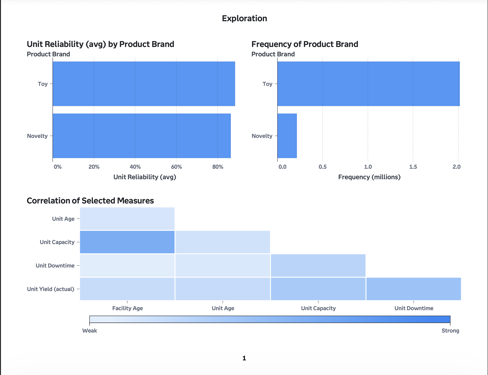
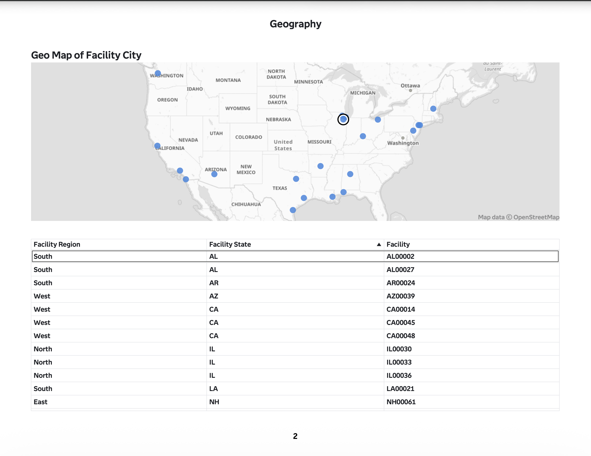
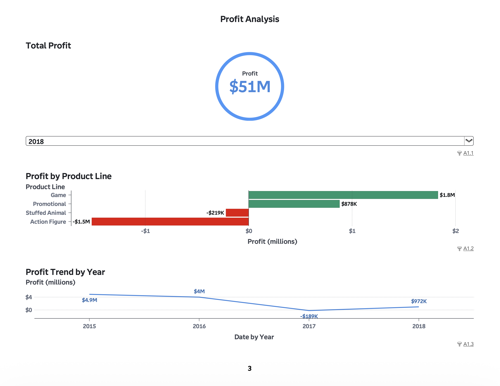

# Megacorp Acquisition Analysis using SAS Visual Analytics

## Overview

Interactive SAS Visual Analytics dashboard analyzing operational performance, manufacturing trends, geographic distribution, and profitability for a fictional toy manufacturing acquisition scenario.

## Tools Used

* SAS Visual Analytics
* SAS Viya for Learners

## Dataset

This project uses the MEGACORP2020 dataset available through SAS Viya for Learners.

The dataset contains over 2.2 million rows and 32 columns covering manufacturing facilities, production operations, product performance, reliability metrics, revenue, expenses, and profit trends.

The full dataset is not included in this repository due to file size limitations.

## Dashboard Features

* Correlation analysis
* Product reliability analysis
* Geographic operational analysis
* KPI reporting
* Product line profitability analysis
* Profit trend analysis
* Interactive filtering and controls

---

## Exploration Dashboard

This dashboard explores relationships between operational measures including unit age, capacity, downtime, reliability, and product brand frequency. Correlation analysis highlights relationships between manufacturing performance variables.

---

## Geography Dashboard

This dashboard visualizes facility locations across the United States and provides regional operational breakdowns by state and facility.

---

## Profit Analysis Dashboard

This dashboard analyzes total company profit, product line profitability, and annual profit trends across multiple years.

---

## Key Insights

* Total profit exceeded $51M
* Game and Promotional product lines generated the strongest profits
* Action Figure and Stuffed Animal product lines operated at losses
* Geographic analysis highlighted operational distribution across multiple U.S. regions
* Correlation analysis identified relationships between operational performance measures

---

## Full Report

[View Full Report](Reports/Megacorp_Acquisition_Analysis_Report.pdf)
